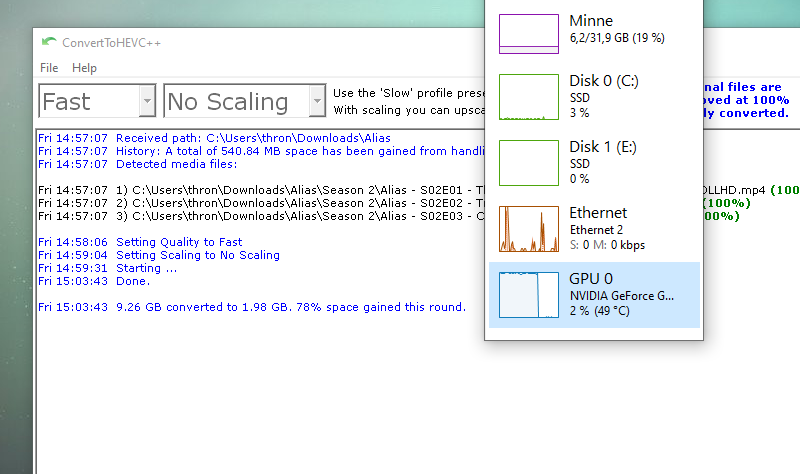

## ConvertToHEVC++ | H.265/HEVC Converter for Windows

Right click on folder or file (MP4,MKV) in explorer you want to convert to H.265/HEVC.  

  

## Features  

* Hardware accelerated bulk or single conversion of x264 media  
to x265/HEVC via NVIDIA NVENC and CUDA FFmpeg toolkit.  

* Automatic recursive search for MKV and MP4 video files via  
Explorer right-click context menu on folder you select.  

* Saves all successful converted video files detected directly  
in their subfolder location where they are found.  

* Supports various quality profiles; Slow, Medium, Fast.  

* Supports scale_cuda bicubic scaling with various settings; 720, 1080, 1440, 2160.  

* Detects existing HEVC video streams in files. These files are kept original.  

* Software has been tested to load a queue of over 5000  
(suggested max) files in just a few seconds from SSD.  

* Supports multiple instances. Useful for multitasking if you have streams available.  

* Keeps a history of statistics about storage capacity gained from converting media.  

* Automatic scrolling during progression.  
Automatic saving of settings between sessions.  
Automatic start option.  

* Processed files are tagged/named HBYT(HEVC By Thronic).  
Any detected subtitles are also named to match video.  

* Original files that are smaller than the converted version,  
are kept as-is and tagged as well to be ignored on future runs.  

* Failed conversions are kept original, but not tagged.  
Making sure streams are available or updating the GPU driver may help.  

* Support for 3rd argument EXITWHENDONE so it can be  
scheduled to run in e.g. taskschd.msc for automation.  

## Additional notes  
If you have a consumer grade GeForce card, you are limited by default to 2 hardware encoding streams.  

Professional Quadro cards are generally unrestricted (except T1000 which is restricted to 3). Converting on a busy
Plex server providing hardware accelerated encoding to users may cause conversions resulting in (Failed) and log
"out of memory" errors in the ffmpeg log. This is normal. Your options are to patch the driver, do the work on a
dedicated computer without other accelerated tasks interfering (gaming not included, it will use GPU not NVENC), or
get a Quadro card.  

The card needs to have [NVENC Support](https://developer.nvidia.com/video-encode-and-decode-gpu-support-matrix-new). I recommend any Turing based card.  
This would generally mean certain GTX 1050 cards, Quadro T1000 or later.  

## Changelog  
**2022.9.26 New release v1.7**  
[+]Added 3 extra command line arguments.  
Example usage of all available parameters:  
ConvertToHEVC++.exe "C:\path\to\video.mp4" EXITWHENDONE quality=slow scaling=AUTOx1080 autostart    
» The scaling and quality arguments MUST match an in-program option, and they are case-sensitive.  
» These 2 arguments will be saved as new defaults; since they are a part of the statistical save routine.  
» EXITWHENDONE will exit the program automatically after completion.  
» The autostart will automatically start the process, even if the setting is not enabled.  

These arguments are intended for scheduled tasking, and it's OK to run multiple instances.  

**2021.5.7 Update for v1.6**  
[🛠]Swapped an internal check against failed results with less than 99% saved instead of larger than 0 bytes.  
A user reported a rare error where a result would be a few KiB and pass previous test.  

**2021.5.1 Latest version v1.6 released May 1st, 2021**  
[+]Now has a checkbox for “Accept bigger files”. Useful when upscaling.  
[+]Self-repair code added for the database.  
A user submitted db had an invalid unsigned long long value logged.  

**2021.2.1 Update for v1.4**  
[🛠]Updated info text for scaling.  
[+] Added 2 new scaling presets AUTOx480, AUTOx576.  

**2021.1.29 New release v1.4**  
[🛠]Fixed a bug where if a queue had been interrupted and a 0 byte HBYT file was left behind, future processing of
that file would silently fail if original was HEVC.  
[+] User requested feature: Support for 3rd argument EXITWHENDONE so it can be scheduled to run in e.g.
taskschd.msc. Remember to put 2nd argument (folder or filename to convert) in quotes("") if you use this feature.  
[+] User requested feature: New checkbox for not detecting HEVC,
for when you want to transcode it anyway (scaling etc).  
[+] New feature: New checkbox for not detecting HBYT tagged files,
for when you want to re-process files for any reason.  

**2021.1.11 Update for v1.3**  
[🛠]Existing HEVC files are now tagged HBYT as well, instead of being entirely skipped.  

**2021.1.9 New release v1.3**  
[🛠] Improvements and fixes. Improved pre-existing HEVC detection by altering the regular expression used. Fixed a
bug where filename searches would include directory as well, causing destination file error. Only affected by
directory names containing encoding type in the name (x264, h.264 etc).  

**2021.1.6 New release v1.2**  
[🛠]Statistics behavior has been changed from saving to DB after full completion, to saving after every converted file.
This will make sure that every converted file is a part if history, even if a batch job has been interrupted and/or
cancelled.  

**2020.12.21 New release v1.1**  
Minor bug fixes and improvements.  

**2020.12.18 Initial release**  
Initial release, v1.0